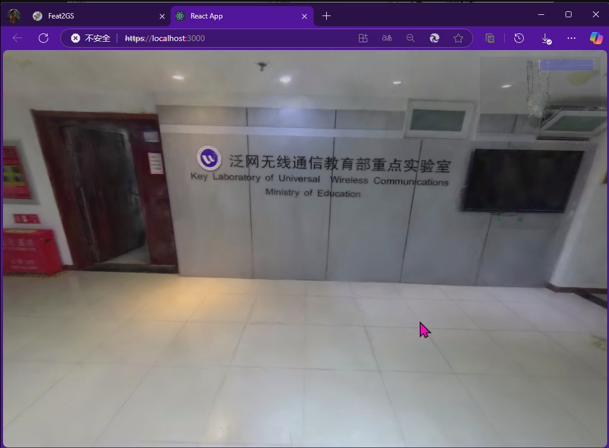

# Gaussian_react

感谢出色的工作🎉https://github.com/mkkellogg/GaussianSplats3D?tab=readme-ov-file

建图算法采用https://github.com/Willyzw/HI-SLAM2进行快速重建
这是一个基于React和Three.js的3D场景查看器，主要用于展示和交互式查看高斯点云数据。
要做的像https://www.digitalcarbon.ai/ 一样

### 预览

更多演示在 ./演示效果.mp4

## 功能特性

- **双画布显示**：主画布显示完整3D场景，叠加画布显示缩略图
- **交互控制**：
  - 键盘控制相机移动（WSAD）
  - Shift+WSAD控制相机旋转
  - 鼠标右键平移场景
  - 滚轮缩放场景
- **区域选择**：点击叠加画布可快速定位到预设区域（大厅、电梯、走廊）
- **动态缩放**：鼠标悬停时叠加画布自动放大
- **高斯点云渲染**：支持PLY格式的点云文件渲染

## 项目结构

src/
├── App.js                  # 主应用组件
├── components/
│   ├── Main/                # 主画布相关组件
│   │   ├── Controls.js      # 相机控制器
│   │   └── MainCanvas.js    # 主画布实现
│   └── Overlay/             # 叠加画布相关组件
│       ├── clickHandler.js  # 点击事件处理
│       ├── controls.js      # 叠加画布控制器
│       └── OverlayCanvas.js # 叠加画布实现

## 控制说明

- 移动 ：W（前）、S（后）、A（左）、D（右）
- 旋转 ：Shift + W/S（上下）、Shift + A/D（左右）
- 缩放 ：鼠标滚轮
- 平移 ：鼠标右键拖动
- 区域选择 ：在叠加画布上点击预设区域
